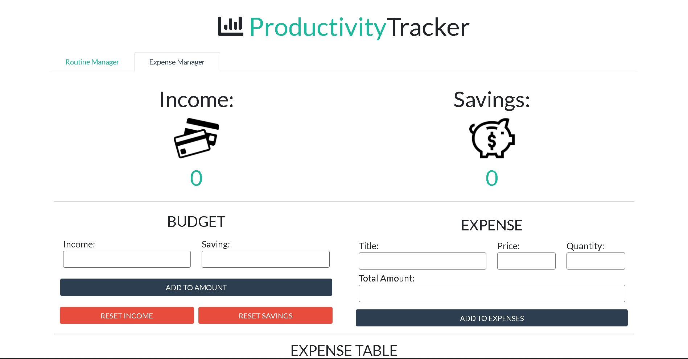

# Productivity Tracker
This is a simple looking app containing two pages __Routine Manager__ & __Expense Manager__.

The __Routine Manager__ handles all your tasks & keep the check on the time spent by you to complete those tasks.

The __Expense Manager__ stores your income & savings & takes all your expenses. Once the expense is paid, it deducts the amount from your income first then your savings.

## I used:
* HTML
* Bootstrap CSS
* JavaScript

## Features:
* Responsive
* Data does not disappears after refreshing (stored in localStorage)
* Sorts the list after reloading

## Preview:
### Routine Manager:

### Expense Manager:
